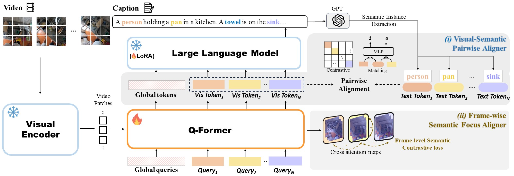

# STEP: Semantic and Temporal Enhanced Projector for Video Large Language Models
We propose STEP, a **S**emantic and **T**emporal **E**nhanced **P**rojector designed to yield semantically distinct and temporally consistent visual tokens for Video Large Language Models.




## Environment Setup


## Training
- **Stage 1**: video-text fine-grained alignment

    ```shell
    # InternVideo2
    bash scripts/pt/1b_qformer_mistral/stage1_8f_fg_sh.sh
    # InternVideo2-HD
    bash scripts/pt/1b_qformer_mistral/stage1_16f_glfgtc_hd.sh
    ```

- **Stage 2**: instruction tuning

    ```shell
    # InternVideo2
    bash scripts/pt/1b_qformer_mistral/stage2_8f_fg_sh.sh
    # InternVideo2-HD
    bash scripts/pt/1b_qformer_mistral/stage2_16f_glfgtc_hd.sh
    ```

- **Stage3**: HD tuning (for InternVideo2-HD only)

  ```shell
  # InternVideo2-HD
  bash scripts/pt/1b_qformer_mistral/stage4_16f_glfgtc_hd.sh
  ```

  

## Evaluation

- Evaluation on video QA benchmarks

    ```shell
    # MVBench
    bash scripts/eval/eval_mistral_mvbench.sh
    # VideoMME
    bash scripts/eval/eval_mistral_videomme.sh
    ```


## Acknowledgement

Thanks to the open-source of following projects:

[MVBench](https://github.com/OpenGVLab/Ask-Anything/tree/main/video_chat2), [InternVideo2](https://github.com/OpenGVLab/InternVideo)

We would like to express sincere gratitude to Chenting Wang for providing the training codebase.